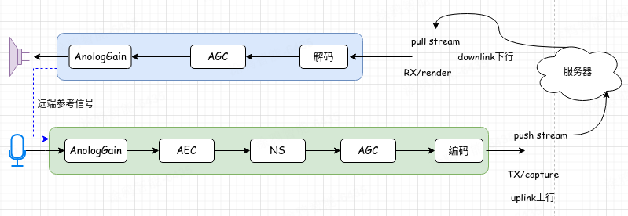
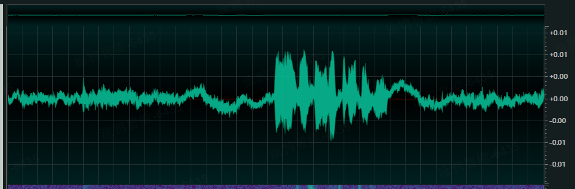
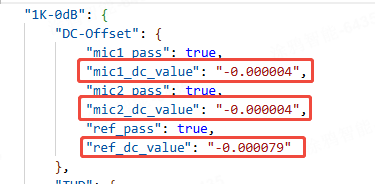
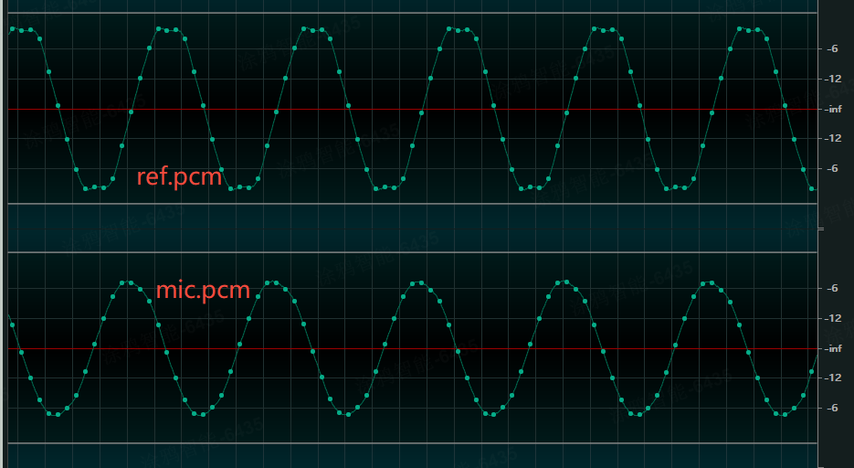
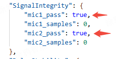
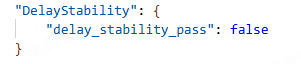

# T5 Audio Debug Guide

## Hardware Acoustic Structure Debugging

Users can refer to this document if they encounter poor experience or unsatisfactory dialogue effects during the use of conversational toys.

The T5 platform debugs audio data as `.pcm` data or `.wav` data, with `16bit` bit depth and `16k` sampling rate.

Recommended software for viewing audio data: `Adobe Audition` or `ocenaudio`

### T5 Audio Processing Flow

AI dialogue is based on traditional streaming technology and shares many similarities with VoIP and live video. Audio processing on T5 includes both upstream and downstream parts. The upstream part includes microphone capture, 3A processing, and speech encoding. The downstream part includes speech decoding, audio processing, and speaker output.



Explanation of related terms in the diagram:

**AGC**: auto gain control

**AEC**: acoustic echo cancellation

**NS**: noise suppression

In addition to what's shown in the diagram, audio processing may also include other modules such as DRC, VAD, etc. Among all audio modules, the AEC module has a significant impact on voice interaction. The effectiveness of echo cancellation is not only related to algorithms but also closely related to hardware performance and structural design. Due to the influence of hardware structure and design, audio processing needs to remove echoes as much as possible while retaining near-end dialogue to ensure smooth AI voice conversation.

### Acoustic Structure Testing

The design of acoustic structure can be checked by playing test audio. Users can play corresponding audio for listening tests according to software instructions. Test audio includes the following types:

+ 1k single frequency, duration 2s, 0dB (explained in script comments)
+ White noise
+ Continuous frequency modulation (50Hz-7500Hz)
+ Silence
+ Discrete frequency modulation (frequency information as follows)

| Frequency (Hz) | Duration (s) | Amplitude (normalized) |
| --- | --- | --- |
| 1000 | 0.5 | 0.8 |
| 7500 | 0.3 | 0.8 |
| 5800 | 0.3 | 0.8 |
| 4500 | 0.3 | 0.8 |
| 3500 | 0.3 | 0.8 |
| 2750 | 0.3 | 0.8 |
| 2150 | 0.3 | 0.8 |
| 1700 | 0.3 | 0.8 |
| 1300 | 0.3 | 0.8 |
| 785 | 0.3 | 0.8 |
| 600 | 0.3 | 0.8 |
| 475 | 0.3 | 0.8 |
| 370 | 0.3 | 0.8 |
| 285 | 0.3 | 0.8 |
| 225 | 0.3 | 0.8 |
| 175 | 0.3 | 0.8 |
| 135 | 0.3 | 0.8 |
| 100 | 0.3 | 0.8 |
| 80 | 0.3 | 0.8 |
| 65 | 0.3 | 0.8 |
| 50 | 0.3 | 0.8 |

One or several of the above signals can be used to judge speaker and microphone performance, whether there is harmonic distortion, DC offset, clipping, etc.

### Audio Issues

1. DC Offset

DC offset (DC Bias) refers to a constant DC voltage component superimposed on the audio signal, causing the signal to deviate from the zero level (reference level) as a whole. This phenomenon may be caused by hardware equipment, circuit design, or issues in the signal transmission process, which adversely affects audio quality.

The following diagram shows waveforms with DC offset and normal audio waveforms:




Slight DC offset has little impact on audio processing. When DC offset is large, it will affect the dynamic range of audio and cause clipping distortion. Values higher than 0.01 or lower than -0.01 suggest using DC offset removal algorithms, such as high-pass filtering. Single frequency white noise in the test program can be used to calculate DC offset.



2. Clipping Distortion

When the audio signal exceeds the maximum numerical value that the digital audio signal can represent, clipping distortion occurs. Based on the hardware feedback circuit adopted by the T5 platform, the feedback signal and microphone signal need to be judged separately.

*Case 1*: For example, when playing 1k single frequency, the ref signal is normal, but the microphone capture signal clips, as shown below.


The possible cause is that the microphone is too close to the speaker, requiring adjustment of the relative position between the microphone and speaker. If the relative position between microphone and speaker cannot be adjusted, it can be adjusted by reducing micgain in the script.

*Case 2*: The ref has clipping, but the microphone signal is normal, as shown below.



The possible cause is excessive speaker volume, requiring reduction of speaker playback volume, which can be adjusted by reducing the volume. The following diagram shows clipping detection passed in test results. If not passed, samples record the total number of sample points that failed.



3. Total Harmonic Distortion

Total Harmonic Distortion (THD) is an important indicator for measuring signal distortion, used to describe the ratio of harmonic components to fundamental wave components in the output signal, reflecting the system's ability to restore the original signal. However, in practice, due to the nonlinear characteristics of components (such as the nonlinear region of transistors and the nonlinear vibration of speaker diaphragms), the output signal will additionally produce harmonics - components whose frequencies are integer multiples of the fundamental frequency of the input signal (such as 2nd harmonic, 3rd harmonic, etc.). The script provides harmonic distortion calculation results based on 1k. Usually, exceeding the speaker's rated power will cause significant harmonic distortion. When harmonic distortion fails, it is recommended to reduce speaker volume. Additionally, poor quality speakers and microphones can also cause harmonic distortion.


THD is generally recommended to be 5% (i.e., 0.05). Values higher than this indicate total harmonic distortion failure.

4. Microphone Consistency

The test program supports acoustic verification of dual microphones. For dual microphone processing algorithms, such as beamforming technology, microphones need to have good consistency. If microphone consistency is poor, it is recommended to replace the microphones.


The higher this correlation coefficient, the better. Ideally it should be 1.0, and it is recommended that this value be higher than 0.7.

5. Delay Stability

If frame loss, data loss, or processing exceptions occur, the microphone and feedback channel data cannot be aligned, resulting in unstable delay. Delay calculation can be performed through the test program to evaluate delay stability.



If this item fails (false), it indicates excessive delay fluctuation, which has a significant impact on AEC and requires data capture combined with specific business content for localization and troubleshooting.

## Audio Algorithm Debugging

All the following commands are sent through the `tyutool` tool.

### AEC (Echo Cancellation) Debugging

AEC (Acoustic Echo Cancellation) algorithm is mainly applied in two-way voice call scenarios. Its core objective is to filter out the echo generated by speaker playback captured by the device microphone, thereby extracting pure local human voice.

---

#### 1. Pre-debugging Checklist

The intensity of echo is closely related to the device's hardware configuration and physical structure, including microphone/speaker sensitivity and gain, product housing layout, acoustic cavity structure, etc. Therefore, before starting AEC parameter debugging, **the following hardware and system states must be fixed** to ensure consistency of the debugging environment:

1. **Microphone (MIC) model fixed**: Different microphone models have different sensitivities. Under the premise of meeting application scenarios, microphones with relatively lower sensitivity can be selected to reduce initial echo.
2. **Microphone (MIC) gain fixed**: Gain size directly affects the amplitude of input audio signal and must remain unchanged.
3. **Speaker model fixed**: Similarly, different speaker models have different sensitivities. Lower sensitivity models can be selected to reduce echo.
4. **Speaker gain fixed**: This gain includes PA (power amplifier) gain and chip internal DAC (digital-to-analog converter) gain. Under the premise of ensuring sufficient volume, lowering this gain as much as possible can effectively reduce echo.
5. **Product structure fixed**: Once the product's housing, acoustic cavity, and other physical structures are determined, they should not be changed again, as any change may cause echo characteristics to vary.

---

#### 2. AEC Parameter List

| Parameter | Description | Default Value | Suggested Range |
| :--- | :--- | :--- |:---|
| `init_flags` | **AEC enable flag**: `0` to disable, `1` to enable. | 1 | `0` / `1` |
| `ec_depth` | **Echo cancellation depth**: Reflects echo intensity. Larger values indicate the algorithm needs to handle stronger echoes. | 20 | `1` ~ `50` |
| `mic_delay` | **Microphone delay**: Unit is sample points, needs to be set precisely according to dumped audio data. | 0 | - |
| `ref_scale` | **Reference signal scaling**: Adjusts the amplitude of reference signal (i.e., far-end voice). Larger values mean greater amplitude. | 0 | `0`, `1`, `2` |
| `voice_vol` | **Voice volume**: Adjusts processed voice volume. | 13 | - |
| `TxRxThr` | **Transmit/Receive threshold upper limit**: Works with `TxRxFlr` to define amplitude judgment range for duplex calls, optimizing echo suppression. | 30 | - |
| `TxRxFlr` | **Transmit/Receive threshold lower limit**: Works with `TxRxThr` to define amplitude judgment range for duplex calls. | 6 | - |
| `ns_level` | **Noise suppression level**: Used to optimize background noise elimination. Higher noise requires higher levels. | 5 | `1` ~ `8` |
| `ns_para` | **Noise suppression parameter**: Fine adjustment of noise suppression. Smaller noise allows smaller values. | 2 | `0`, `1`, `2` |
| `drc` | **Dynamic range compression**: Adjusts output volume. Larger values mean higher volume. | 4 | `0x10` ~ `0x1f` |

---

#### 3. AEC Debugging Steps

1. **Confirm prerequisites**: Ensure all items in the "Pre-debugging Checklist" above have been completed and fixed.
2. **Online debugging**: Adjust AEC parameters online through script serial commands based on real-time heard echo effects.
3. **Adjust echo depth (`ec_depth`)**:
   * **Command**: `aec_ec_depth <value>`
   * **Method**: Adjust this parameter first. The larger the echo, the larger the value should be set. Continue increasing this value until echo cancellation effect no longer improves.
4. **Adjust duplex thresholds (`TxRxThr` / `TxRxFlr`)**:
   * **Command**: `aec_TxRxThr <value>` and `aec_TxRxFlr <value>`
   * **Method**: According to echo size range, set maximum and minimum amplitudes of transmitted and received audio data respectively to optimize echo cancellation effect.
5. **Adjust noise suppression level (`ns_level`)**:
   * **Command**: `aec_ns_level <value>`
   * **Method**: Adjust according to heard background noise size. Larger noise requires higher values.
6. **Adjust noise suppression parameter (`ns_para`)**:
   * **Command**: `aec_ns_para <value>`
   * **Method**: Fine-tune based on `ns_level`. Smaller noise allows smaller values. Choose the value with best subjective effect.
7. **Get and record parameters**:
   * **Command**: `alg dump`
   * **Method**: After all parameter adjustments are satisfactory, use this command to get all currently effective parameter values.
8. **Solidify parameters**: Record the dumped parameter values and update them in your development environment.

---
### VAD (Voice Activity Detection) Debugging

VAD (Voice Activity Detection) is used to determine whether there is currently valid voice activity.

#### 1. VAD Parameter List

| Parameter | Description | Default Value |
| :--- | :--- | :--- |
| `SPthr[0]` | **Mid-low frequency energy threshold**: Basic energy judgment standard for VAD. If microphone gain is reduced, this value should also be reduced accordingly. | Single MIC: 3500<br>Dual MIC: 350 |
| `SPthr[1]` | **VAD activation score threshold**: Determines VAD trigger sensitivity. | 98 |
| `SPthr[2]` | **Cumulative score upper limit**: Maximum cumulative score used for VAD end judgment. | 150 |
| `SPthr[3]` | **Voice frame scoring weight (high probability)**: Scoring weight for high-probability voice frames. | 3 |
| `SPthr[4]` | **Voice frame scoring weight (medium probability)**: Scoring weight for medium-probability voice frames. | 4 |
| `SPthr[5]` | **Silence decay step**: Additional decay value of cumulative score per frame when judged as silence. | 5 |
| `SPthr[6]` | VAD energy threshold parameter | 320 |
| `SPthr[7]` | VAD energy threshold parameter | 1000 |
| `SPthr[8]` | VAD energy threshold parameter | 2 |
| `SPthr[9]` | VAD energy threshold parameter | 24 |
| `SPthr[10]`| VAD energy threshold parameter | 3 |
| `SPthr[11]`| VAD energy threshold parameter | 21 |
| `SPthr[12]`| VAD energy threshold parameter | 3 |
| `SPthr[13]`| VAD energy threshold parameter | 18 |

---

#### 2. VAD Debugging Steps

1. **Confirm prerequisites**: Ensure AEC debugging is completed and system state is stable.
2. **Online debugging**: Adjust VAD parameters online through script serial commands based on actual voice detection effects.
3. **[Optional] Query parameters**: Use `alg dump` command to get and view current VAD parameter configuration at any time.
4. **Adjust basic energy threshold (`SPthr[0]`)**:
   * **Command**: `vad_SPthr 0 <value>`
   * **Method**: Set appropriate silence filtering threshold. The larger this value, the stronger the filtering capability. Gradually increase this value until silence effect is optimal without affecting normal voice recognition. Suggested range `0 ~ 10000`.
5. **Adjust VAD activation sensitivity (`SPthr[1]/SPthr[3]/SPthr[4]`)**:
   * **Core mechanism**: The system judges voice activity by scoring each frame of data and accumulating scores (denoted as `cnt`). Silent frames score 0, voice frames score 0-7 based on probability.
   * **`SPthr[1]` (activation score threshold)**: When cumulative score `cnt > SPthr[1]`, VAD is activated.
       * **Decrease this value**: VAD trigger is more sensitive and starts faster.
       * **Increase this value**: Can filter short bursts of noise but may cause VAD startup delay. If this value is large, a larger buffer needs to be configured.
   * **Recommended parameter combinations (VAD activation)**:
       ```c
       // Case 1: Fast activation
       SPthr[1] = 40; SPthr[3] = 5; SPthr[4] = 6;
       // Case 2: (Default)
       SPthr[1] = 98; SPthr[3] = 3; SPthr[4] = 4;
       // Case 3: Slow activation
       SPthr[1] = 98; SPthr[3] = 2; SPthr[4] = 3;
       ```
6. **Adjust VAD end speed (`SPthr[2]/SPthr[5]`)**:
   * **Core mechanism**: When no voice is detected, cumulative score `cnt` decreases by 1 per frame and additionally decreases by the value of `SPthr[5]`. VAD ends when `cnt` reaches 0.
   * **`SPthr[5]` (additional decay value)**: The larger this value, the faster `cnt` decreases and VAD ends faster.
   * **`SPthr[2]` (score upper limit)**: Limits the maximum value of cumulative score `cnt`.
   * **Recommended parameter combinations (VAD end)**:
       ```c
       // Case 1: Fast end
       SPthr[2] = 150; SPthr[5] = 9;
       // Case 2: (Default)
       SPthr[2] = 150; SPthr[5] = 1;
       // Case 3: Slow end
       SPthr[2] = 150; SPthr[5] = 0;
       ```