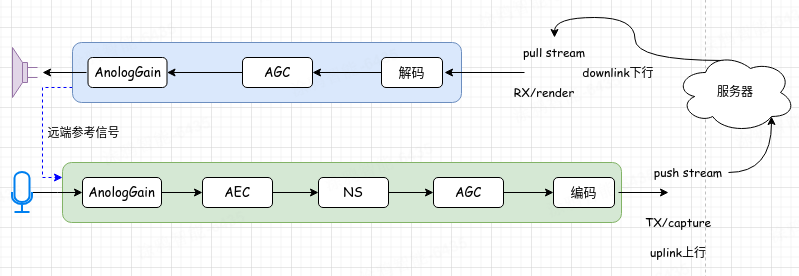
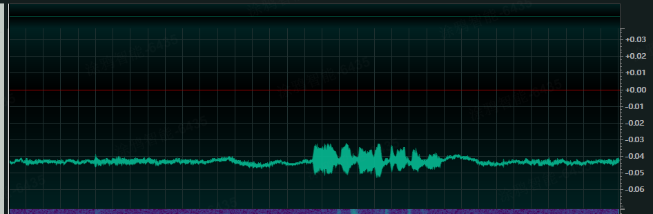
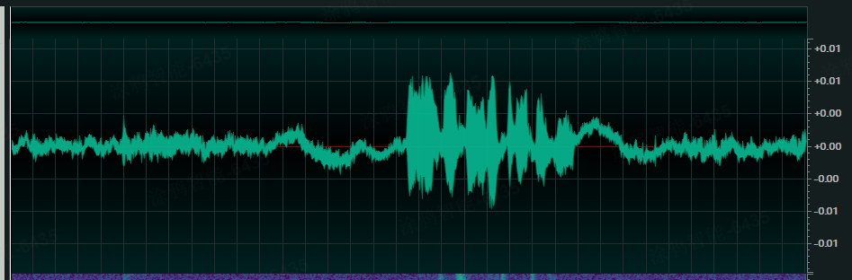
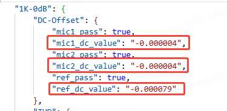
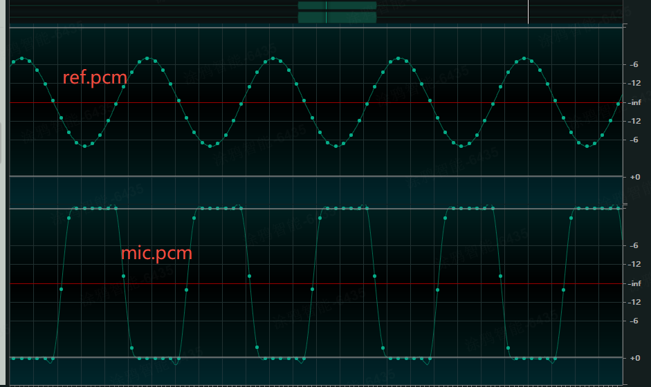
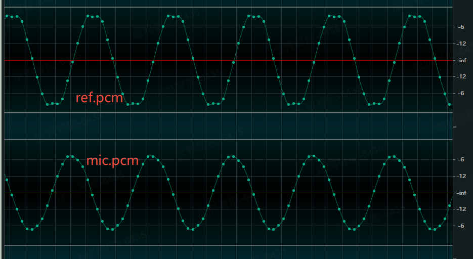
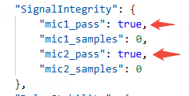
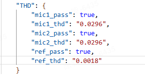
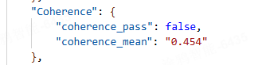
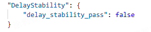

# T5音频调试指南

## 硬件声学结构调试

用户在对话类玩具使用过程中，如果出现体验不佳，对话效果较差等问题，可参考本文档。

T5平台调试音频数据为`.pcm`数据或者`.wav`数据，`16bit`位宽，`16k`采样率。

推荐查看音频数据软件`Adobe Audition`或者`ocenaudio`

### T5音频处理流程

AI对话基于传统流媒体技术，和VOIP以及直播视频有诸多相似之处，T5上的音频处理包括推流和拉流两个部分，推流部分麦克风采集、3A处理、语音编码等部分，拉流部分包括语音解码、音频处理、扬声器输出等部分。



图中相关名词解释：

**AGC**: auto gain control,自动增益控制

**AEC**: acoustic echo cancellation, 回声消除

**NS**: noise suppression, 噪声抑制

音频处理除图中所示外，还可能包括其他如DRC、VAD等模块，在音频各模块中，对语音交互影响比较大的是AEC模块，回声消除的效果不仅和算法有关，还和硬件性能、结构设计等关系密切。由于硬件结构和设计上带来的影响，音频处理上需要在尽可能去除回声的同时保留近端对话，以保证AI语音对话的流畅性。

### 声学结构测试

声学结构的设计可以通过播放测试音频来进行检查，用户可按照软件说明播放对应的音频进行试听，测试音频包括以下几种：

+ 1k单频，持续时间2s，0dB（脚本备注中有说明）
+ 白噪声
+ 连续调频（50Hz-7500Hz）
+ 静音
+ 离散调频（频率信息如下）

| 频率（Hz） | 时长（s） | 幅度（归一化） |
| --- | --- | --- |
| 1000 | 0.5 | 0.8 |
| 7500 | 0.3 | 0.8 |
| 5800 | 0.3 | 0.8 |
| 4500 | 0.3 | 0.8 |
| 3500 | 0.3 | 0.8 |
| 2750 | 0.3 | 0.8 |
| 2150 | 0.3 | 0.8 |
| 1700 | 0.3 | 0.8 |
| 1300 | 0.3 | 0.8 |
| 785 | 0.3 | 0.8 |
| 600 | 0.3 | 0.8 |
| 475 | 0.3 | 0.8 |
| 370 | 0.3 | 0.8 |
| 285 | 0.3 | 0.8 |
| 225 | 0.3 | 0.8 |
| 175 | 0.3 | 0.8 |
| 135 | 0.3 | 0.8 |
| 100 | 0.3 | 0.8 |
| 80 | 0.3 | 0.8 |
| 65 | 0.3 | 0.8 |
| 50 | 0.3 | 0.8 |

可利用播放上述其中一个或者几个信号用来判断扬声器和麦克风性能，是否有谐波失真，是否有直流偏置，有无削波等。

### 音频问题

1. 直流偏置

直流偏置（DC Bias） 指的是音频信号中叠加的一个恒定直流电压分量，导致信号整体偏离零电平（参考电平）。这种现象可能由硬件设备、电路设计或信号传输过程中的问题引起，对音频质量产生不良影响。

下图给出了有直流偏置和正常音频波形示意图





轻微直流偏置对音频处理影响不大，直流偏置较大时会影响音频的动态范围，导致削波失真。高于0.01或者低于-0.01建议采用去直流偏移的算法，比如高通滤波等。测试程序中单频白噪声均可用来计算直流偏置。



2. 削波失真

当音频信号超过了音频数字信号所能表示的最大数值时，会引起削波失真。基于T5平台采用的是硬件回采电路，需要对回采信号和麦克信号进行分别判断。

*情形1*：比如播放1k单频的情况下，ref信号正常，麦克采集信号削波，如下图所示。



可能的原因是麦克距离喇叭太近导致，需要调整麦克和喇叭的相对位置。如果不能调整麦克和喇叭的相对位置，则可以通过脚本中降低micgain来进行调整。

*情形2*：ref有削波，麦克信号正常，如下图所示



可能得原因是喇叭响度过大导致，需要降低喇叭的播放响度，可以通过降低volume来进行调整。下图给出了测试结果中削波检测通过，如果未通过，samples记录了总共未通过的采样点数。



3. 总谐波失真

总谐波失真（Total Harmonic Distortion，简称 THD） 是衡量信号失真程度的重要指标，用于描述输出信号中谐波成分与基波成分的比例，反映系统对原始信号的还原能力。但实际中，由于器件的非线性特性（如晶体管的非线性区、扬声器振膜的非线性振动），输出信号中会额外产生谐波—— 即频率为输入信号基波频率整数倍的成分（如 2 倍频、3 倍频等），脚本中提供了基于1k的谐波失真计算结果。通常情况下超过扬声器额定功率会引起较大的谐波失真，建议谐波失真不通过时降低喇叭音量，此外，喇叭质量和麦克风质量不高的情况下也会引起谐波失真。



thd一般建议为5％（即0.05），高于此值则表示总谐波失真不通过。


4. 麦克一致性

测试程序支持双麦的声学验证，对于双麦处理算法，比如beamforming技术等，需要麦克具有较好的一致性。如果麦克一致性较差时建议更换麦克风。



此相关系数越高越好，理想情况下为1.0，建议此值高于0.7

5. 延时稳定性

如果出现丢帧、数据丢失或者处理异常等情况会导致麦克和回采通道数据无法对齐，从而出现延时不稳定的情况，可通过测试程序进行延时计算，评估延时稳定情况。



如果此项未通过（false）,表示延时波动过大，对AEC有较为明显的影响，需要结合具体业务内容抓取数据进行定位排查。

## 音频算法调试

以下所有指令均通过 `tyutool` 工具发送。

### AEC（回声消除）调试

AEC（Acoustic Echo Cancellation）回声消除算法主要应用于双向语音通话场景。其核心目标是滤除设备麦克风采集到的、由扬声器播放所产生的回声，从而提取出纯净的本地人声。

---

#### 1. 调试前置检查清单

回声的强度与设备的硬件配置和物理结构紧密相关，包括麦克风/扬声器的灵敏度与增益、产品外壳布局、音腔结构等。因此，在开始调试AEC参数前，**必须确保以下硬件与系统状态已经固定**，以保证调试环境的一致性：

1.  **麦克风（MIC）型号固定**：不同型号的麦克风灵敏度各异。在满足应用场景的前提下，可选用灵敏度相对较低的麦克风以减小初始回声。
2.  **麦克风（MIC）增益固定**：增益大小直接影响输入音频信号的幅值，必须保持不变。
3.  **扬声器（Speaker）型号固定**：同理，不同型号的扬声器灵敏度不同。可选用灵敏度较低的型号来降低回声。
4.  **扬声器（Speaker）增益固定**：此增益包含PA（功率放大器）增益和芯片内部的DAC（数模转换器）增益。在保证音量足够的前提下，尽量调低此增益可有效减小回声。
5.  **产品结构固定**：产品的外壳、音腔等物理结构一旦确定，不应再更改，因为任何变动都可能导致回声特性发生变化。

---

#### 2. AEC 参数列表

| 参数 | 说明 | 默认值 | 建议范围 |
| :--- | :--- | :--- |:---|
| `init_flags` | **AEC启用标志**：`0`为禁用，`1`为启用。 | 1 | `0` / `1` |
| `ec_depth` | **回声消除深度**：反映了回声的强度。值越大，表示算法需要处理的回声越大。 | 20 | `1` ~ `50` |
| `mic_delay` | **麦克风延时**：单位为采样点，需根据dump的音频数据进行精确设置。 | 0 | - |
| `ref_scale` | **参考信号缩放**：调整参考信号（即远端语音）的幅度。值越大，幅度越大。 | 0 | `0`, `1`, `2` |
| `voice_vol` | **语音音量**：调整处理后的语音音量。 | 13 | - |
| `TxRxThr` | **发送/接收阈值上限**：与`TxRxFlr`配合，定义双工通话的幅度判断范围，优化回声抑制。 | 30 | - |
| `TxRxFlr` | **发送/接收阈值下限**：与`TxRxThr`配合，定义双工通话的幅度判断范围。 | 6 | - |
| `ns_level` | **噪声抑制级别**：用于优化背景底噪的消除效果。底噪越大，所需级别越高。 | 5 | `1` ~ `8` |
| `ns_para` | **噪声抑制参数**：对噪声抑制的精细调节。底噪越小，此值可设置得越小。 | 2 | `0`, `1`, `2` |
| `drc` | **动态范围压缩**：调整输出音量。值越大，音量越大。 | 4 | `0x10` ~ `0x1f` |

---

#### 3. AEC 调试步骤

1.  **确认前提**：确保上文“调试前置检查清单”中的所有项目均已完成并固定。
2.  **在线调试**：根据实时听到的回声效果，通过脚本发送串口指令，在线调整AEC参数。
3.  **调整回声深度 (`ec_depth`)**：
    * **指令**: `aec_ec_depth <value>`
    * **方法**: 首先调整此参数。回声越大，值应设置得越大。持续增大该值，直到回声消除效果不再提升时停止。
4.  **调整双工阈值 (`TxRxThr` / `TxRxFlr`)**：
    * **指令**: `aec_TxRxThr <value>` 和 `aec_TxRxFlr <value>`
    * **方法**: 根据回声大小范围，分别设置发送和接收音频数据的最大和最小振幅，以优化回声消除效果。
5.  **调整噪声抑制级别 (`ns_level`)**：
    * **指令**: `aec_ns_level <value>`
    * **方法**: 根据听到的背景底噪大小进行调整。底噪越大，设置的值应越高。
6.  **调整噪声抑制参数 (`ns_para`)**：
    * **指令**: `aec_ns_para <value>`
    * **方法**: 在`ns_level`基础上微调，底噪越小，此值可设置得越小。选择体感效果最佳的值。
7.  **获取并记录参数**：
    * **指令**: `alg dump`
    * **方法**: 所有参数调整满意后，使用此指令获取当前生效的所有参数值。
8.  **固化参数**：将`dump`出的参数值记录下来，并更新到您的开发环境中。

---
### VAD（语音活动检测）调试

VAD（Voice Activity Detection）用于判断当前是否存在有效的语音活动。

#### 1. VAD 参数列表

| 参数 | 说明 | 默认值 |
| :--- | :--- | :--- |
| `SPthr[0]` | **中低频能量阈值**：VAD的基础能量判断标准。若麦克风增益调低，此值也需适当减小。 | 单MIC: 3500<br>双MIC: 350 |
| `SPthr[1]` | **VAD激活分数阈值**：决定VAD触发的灵敏度。 | 98 |
| `SPthr[2]` | **累计分数上限**：用于VAD结束判断的累计分数的最大值。 | 150 |
| `SPthr[3]` | **语音帧评分权重 (高概率)**：高概率语音帧的评分权重。 | 3 |
| `SPthr[4]` | **语音帧评分权重 (中概率)**：中概率语音帧的评分权重。 | 4 |
| `SPthr[5]` | **静音衰减步长**：判断为静音时，每帧累计分数的额外衰减值。 | 5 |
| `SPthr[6]` | VAD能量阈值参数 | 320 |
| `SPthr[7]` | VAD能量阈值参数 | 1000 |
| `SPthr[8]` | VAD能量阈值参数 | 2 |
| `SPthr[9]` | VAD能量阈值参数 | 24 |
| `SPthr[10]`| VAD能量阈值参数 | 3 |
| `SPthr[11]`| VAD能量阈值参数 | 21 |
| `SPthr[12]`| VAD能量阈值参数 | 3 |
| `SPthr[13]`| VAD能量阈值参数 | 18 |

---

#### 2. VAD 调试步骤

1.  **确认前提**：确保AEC调试已完成，系统状态稳定。
2.  **在线调试**：通过脚本发送串口指令，根据实际语音检测效果，在线调整VAD参数。
3.  **[可选] 查询参数**：使用 `alg dump` 指令，可随时获取并查看当前的VAD参数配置。
4.  **调整基础能量阈值 (`SPthr[0]`)**：
    * **指令**: `vad_SPthr 0 <value>`
    * **方法**: 设置合适的静音过滤阈值。该值越大，过滤能力越强。逐步增大该值，直至在不影响正常语音识别的前提下，静音效果达到最佳。建议范围 `0 ~ 10000`。
5.  **调整VAD激活灵敏度 (`SPthr[1]/SPthr[3]/SPthr[4]`)**：
    * **核心机制**: 系统通过对每帧数据评分并累计分数（记作`cnt`）来判断语音活动。静音帧为0分，语音帧根据概率得分为0-7分。
    * **`SPthr[1]` (激活分数阈值)**: 当累计分数 `cnt > SPthr[1]` 时，VAD被激活。
        * **调小此值**: VAD触发更灵敏，启动更快。
        * **调大此值**: 可过滤短促噪声，但可能导致VAD启动延迟。若此值较大，需配置更大的缓冲区（Buffer）。
    * **推荐参数组合 (VAD激活)**:
        ```c
        // Case 1: 快速激活
        SPthr[1] = 40; SPthr[3] = 5; SPthr[4] = 6;
        // Case 2: (默认)
        SPthr[1] = 98; SPthr[3] = 3; SPthr[4] = 4;
        // Case 3: 慢速激活
        SPthr[1] = 98; SPthr[3] = 2; SPthr[4] = 3;
        ```
6.  **调整VAD结束速度 (`SPthr[2]/SPthr[5]`)**：
    * **核心机制**: 当未检测到语音时，累计分数`cnt`每帧减1，并额外再减去`SPthr[5]`的值。`cnt`为0时VAD结束。
    * **`SPthr[5]` (额外衰减值)**: 此值越大，`cnt`下降越快，VAD结束也越快。
    * **`SPthr[2]` (分数上限)**: 限制了累计分数`cnt`的最大值。
    * **推荐参数组合 (VAD结束)**:
        ```c
        // Case 1: 快速结束
        SPthr[2] = 150; SPthr[5] = 9;
        // Case 2: (默认)
        SPthr[2] = 150; SPthr[5] = 1;
        // Case 3: 慢速结束
        SPthr[2] = 150; SPthr[5] = 0;
        ```
